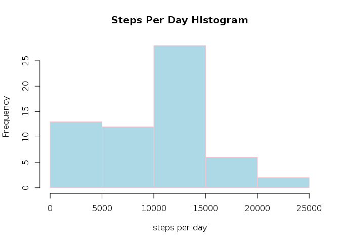
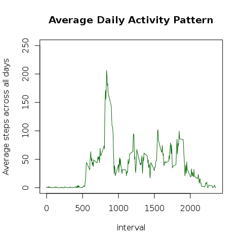
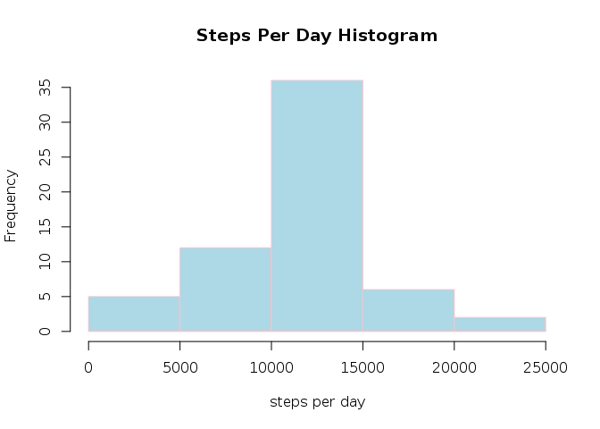
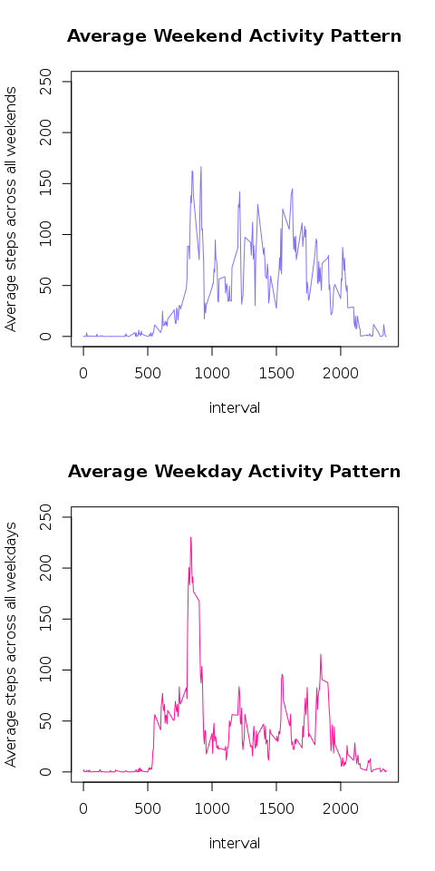

# Reproducible Research: Peer Assessment 1

## Loading and preprocessing the data


Import required libraries and then extract activity.csv from the zip file if it does not exist:

```r
library("plyr")

if(!file.exists("./activity.csv")){
    unzip(zipfile="./activity.zip")
}
activity_raw = read.csv("./activity.csv")
str(activity_raw)
```

```
## 'data.frame':	17568 obs. of  3 variables:
##  $ steps   : int  NA NA NA NA NA NA NA NA NA NA ...
##  $ date    : Factor w/ 61 levels "2012-10-01","2012-10-02",..: 1 1 1 1 1 1 1 1 1 1 ...
##  $ interval: int  0 5 10 15 20 25 30 35 40 45 ...
```

## What is mean total number of steps taken per day?

```r
# Find the total number of steps per day 
steps_per_day = ddply( activity_raw, "date", summarise
                     , total = sum(steps, na.rm=T)
                     , avg   = mean(steps, na.rm=T)
                     , med   = median(steps, na.rm=T)
                     )
# Draw the steps per day histogram
hist( x      = steps_per_day$total
    , col    = "lightblue" 
    , border = "pink"
    , main   = "Steps Per Day Histogram"
    , xlab   = "steps per day"
    )
```

\

The mean and the median are as follows:
```
Mean: 9354.2295082
Median: 10395
```

## What is the average daily activity pattern?
Here is a time series plot of the 5-minute interval (x-axis) and the average number of steps taken, averaged across all days (y-axis)

```r
# Time series plot of average daily activity pattern
daily_activity = ddply( activity_raw
                      , "interval"
                      , summarise
                      , avg = mean(steps, na.rm=T)
                      )

plot( x      = daily_activity
    , col    = "darkgreen"
    , type   = "l"
    , main   = "Average Daily Activity Pattern"
    , ylab   = "Average steps across all days"
    , ylim   = c(0,250)
    )
```

\

To find the 5-minute interval, on average across all the days in the dataset that contains the maximum number of steps:


```r
max_interval_index = which.max(daily_activity$avg)
daily_activity$interval[max_interval_index]
```

```
## [1] 835
```

## Imputing missing values

Number of rows that contain an NA:

```r
# Number of incomplete records
num_missing = sum(!complete.cases(activity_raw))
print(num_missing)
```

```
## [1] 2304
```
To address the issue of missing values, we're going to replace all the NA values with the mean number of steps within the same interval, averaged across all days:

```r
# Fill the missing data with the mean of that interval
index_complete   = complete.cases(activity_raw)
replace_na = function(x) {
                return(daily_activity[daily_activity$interval == x,"avg"])
             }

activity_filled = activity_raw
activity_filled[!index_complete,] = ddply( activity_raw[!index_complete,]
                                         , .(date, interval)
                                         , transform
                                         , steps = replace_na(interval)
                                         )
```

Now we recalculate the median and mean total number of steps per day to compare to the our previous results:


```r
# Find the total number of steps per day, 
steps_per_day = ddply( activity_filled, "date", summarise
                     , total = sum(steps, na.rm=T)
                     , avg   = mean(steps, na.rm=T)
                     , med   = median(steps, na.rm=T)
                     )

# Draw the steps per day histogram
hist( x      = steps_per_day$total
    , col    = "lightblue" 
    , border = "pink"
    , main   = "Steps Per Day Histogram"
    , xlab   = "steps per day"
    )
```

\

New mean and median values:

```
Mean: 1.0766189\times 10^{4}
Median: 1.0766189\times 10^{4}
```

As we can see, the new mean and median are much closer to each other meaning that the distribution of total daily steps is less skewed and more normal after filling the NAs with average steps per interval.

## Are there differences in activity patterns between weekdays and weekends?

In order to compare daily activity patterns of weekends versus weekdays, we construct a new dataframe with a new column indicating whether the record was obtained on a weekday or a weekend:


```r
isWeekday = function(x) {
                day = weekdays(as.Date(x),T)
                return(ifelse(day %in% c("Sun","Sat")
                             ,"weekend"
                             ,"weekday"
                             )
                      )  
            }

activity_filled_ext = transform(activity_filled, day = isWeekday(date))
activity_filled_ext$day = as.factor(activity_filled_ext$day)
```

Now we plot the time series of weekend and weekday activity patterns and compare them side by side:

```r
# Time series plot of average Weekend/Weekday activity pattern
weekend_activity = ddply( activity_filled_ext[activity_filled_ext$day == "weekend",]
                        , "interval"
                        , summarise
                        , avg = mean(steps, na.rm=T)
                        )
weekday_activity = ddply( activity_filled_ext[activity_filled_ext$day == "weekday",]
                        , "interval"
                        , summarise
                        , avg = mean(steps, na.rm=T)
                        )
par(mfrow=c(2,1))
plot( x      = weekend_activity
    , col    = "lightslateblue"
    , type   = "l"
    , main   = "Average Weekend Activity Pattern"
    , ylab   = "Average steps across all weekends"
    , ylim   = c(0,250)
    )
plot( x      = weekday_activity
    , col    = "deeppink"
    , type   = "l"
    , main   = "Average Weekday Activity Pattern"
    , ylab   = "Average steps across all weekdays"
    , ylim   = c(0,250)
    )
```

\

It apprears while there's a spike in activity between 600-1000 intervals on both weekends and weekdays, there is higher activity after 1000 interval during weekends compared to weekdays.
